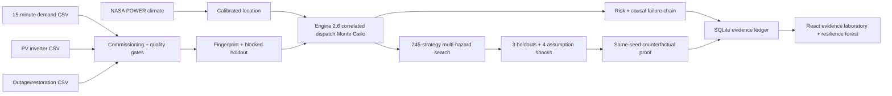

# Grounded architecture

## Trust boundaries

- Climate observations and operational measurements are immutable inputs to a
  run fingerprint.
- The simulation package is pure and deterministic; API and persistence code
  cannot change scenario physics.
- Optimization discovery seeds are disjoint from validation cohorts.
- Starting battery energy receives no renewable credit.
- Public reference data and commissioned site data are different schema scopes
  and receive different interface labels.
- The UI renders server evidence; it cannot award a successful audit by itself.

## Runtime

Fastify serves the React production bundle, REST endpoints and WebSocket stream.
SQLite stores complete run summaries and forest growth. A Docker health check
verifies the API. NASA calibration is cached for an offline-safe demonstration.
